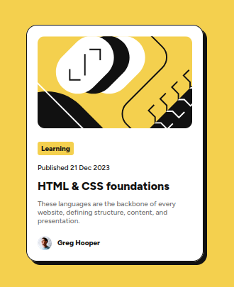

# Frontend Mentor - Blog preview card solution

Esta é uma solução para o desafio do Cartão de visualização do blog no [Frontend Mentor](https://www.frontendmentor.io/challenges/blog-preview-card-ckPaj01IcS). Os desafios do Frontend mentor ajuda você a melhorar as suas habilidades de programação através da construção de projetos realísticos.

## Tabela de conteúdos

- [Visão geral](#visão-geral)
  - [O desafio](#o-desafio)
  - [Imagem do projeto feito](#imagem-do-projeto-feito)
  - [Links](#links)
- [Construído com](#construído-com)
- [Autor](#autor)

##  Visão Geral

## O desafio

O desafio consistia em construir uma página de um cartão de visualização de um blog da maneira mais semelhante possível ao modelo que foi sugerido.

### Imagem do projeto feito

### Links

- Solução URL: [URL da solução]()
- Live Site URL: [Live site URL]()

## Construído com

- HTML5
- CSS
- Visual Studio Code

## Autor

- Frontend Mentor - [@moisesferreira123](https://www.frontendmentor.io/profile/moisesferreira123)
- GitHub - [@moisesferreira123](https://github.com/moisesferreira123)
